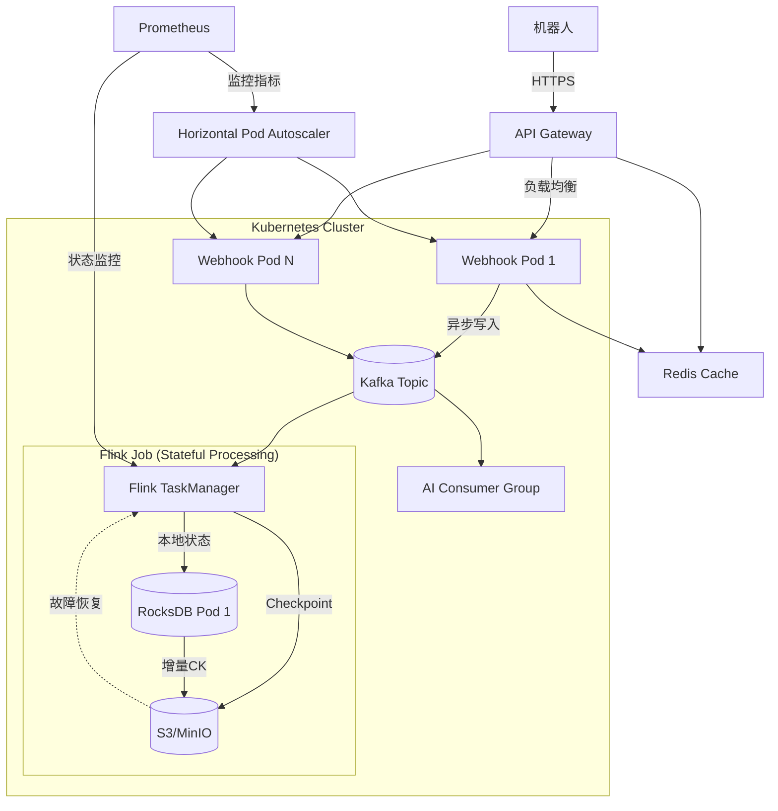
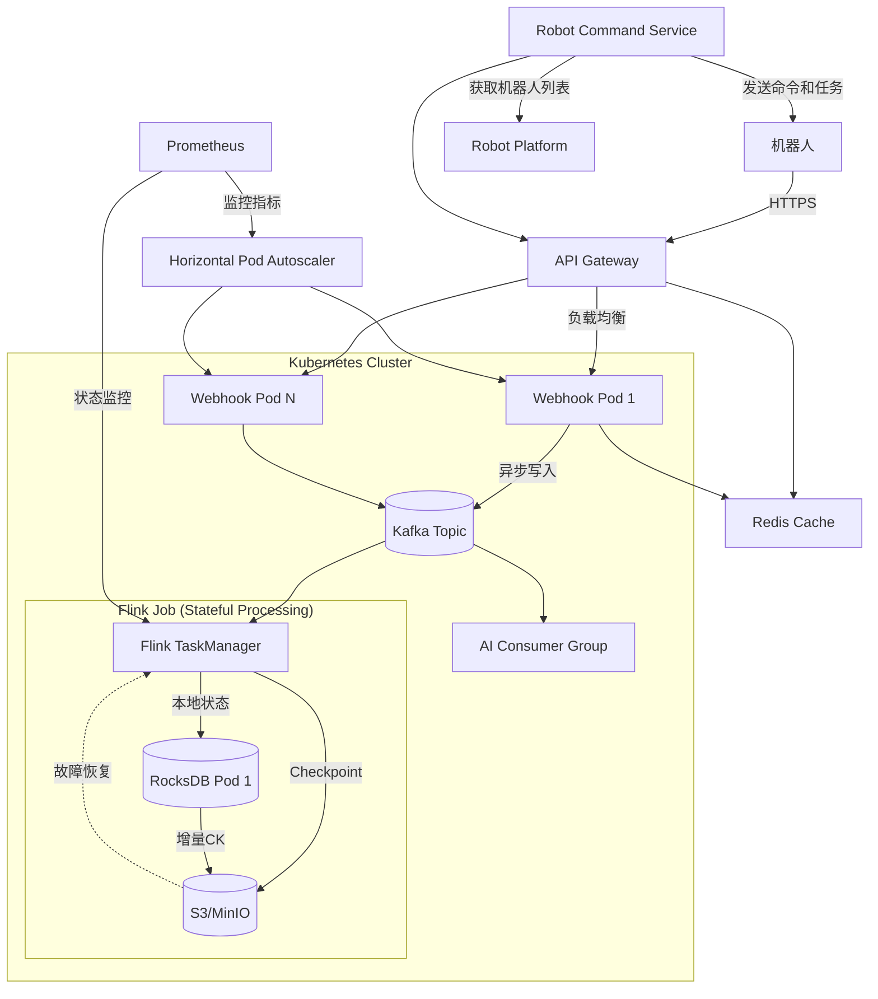

## K8s+kafka 

```mermaid
graph TD
    A[机器人] -->|HTTPS| B[API Gateway]
    B -->|负载均衡| C1[Webhook Pod 1]
    B --> C2[Webhook Pod N]
    
    subgraph Kubernetes Cluster
        C1 -->|异步写入| D[(Kafka Topic)]
        C2 --> D
        
        subgraph "Flink Job (Stateful Processing)"
            E[Flink TaskManager]
            E -->|本地状态| F1[(RocksDB Pod 1)]
            E -->|Checkpoint| F2[(S3/MinIO)]
        end
        
        D --> E
        D --> G[AI Consumer Group]
        
        F1 -->|增量CK| F2
        F2 -.->|故障恢复| E
    end
    
    B --> H[Redis Cache]
    C1 --> H
    I[Prometheus] -->|监控指标| J[Horizontal Pod Autoscaler]
    J --> C1
    J --> C2
    I -->|状态监控| E
```
# k8s+kafka 添加了调度服务

```mermaid
graph TD
    A[机器人] -->|HTTPS| B[API Gateway]
    B -->|负载均衡| C1[Webhook Pod 1]
    B --> C2[Webhook Pod N]
    
    subgraph Kubernetes Cluster
        C1 -->|异步写入| D[(Kafka Topic)]
        C2 --> D
        
        subgraph "Flink Job (Stateful Processing)"
            E[Flink TaskManager]
            E -->|本地状态| F1[(RocksDB Pod 1)]
            E -->|Checkpoint| F2[(S3/MinIO)]
        end
        
        D --> E
        D --> G[AI Consumer Group]
        
        F1 -->|增量CK| F2
        F2 -.->|故障恢复| E
    end
    
    B --> H[Redis Cache]
    C1 --> H
    I[Prometheus] -->|监控指标| J[Horizontal Pod Autoscaler]
    J --> C1
    J --> C2
    I -->|状态监控| E

    %% 新增的机器人命令服务
    K[Robot Command Service] -->|获取机器人列表| L[Robot Platform]
    K -->|发送命令和任务| A
    K --> B

```