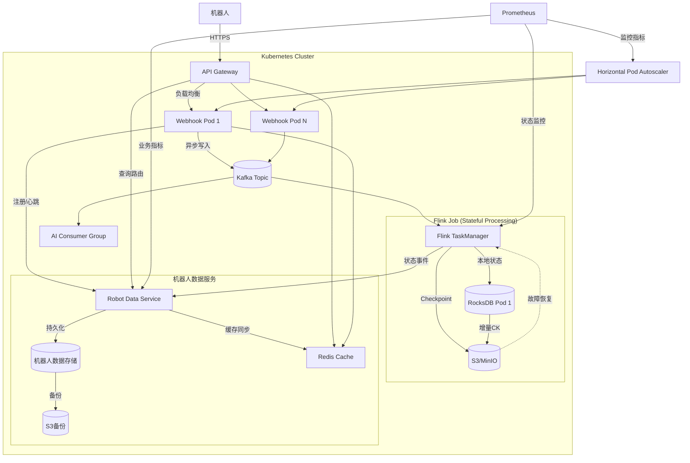

deepseek

```mermaid
graph TD
    A[机器人] -->|HTTPS| B[API Gateway]
    B -->|负载均衡| C1[Webhook Pod 1]
    B --> C2[Webhook Pod N]
    
    subgraph Kubernetes Cluster
        C1 -->|异步写入| D[(Kafka Topic)]
        C2 --> D
        
        subgraph "Flink Job (Stateful Processing)"
            E[Flink TaskManager]
            E -->|本地状态| F1[(RocksDB Pod 1)]
            E -->|Checkpoint| F2[(S3/MinIO)]
        end
        
        D --> E
        D --> G[AI Consumer Group]
        
        F1 -->|增量CK| F2
        F2 -.->|故障恢复| E
        
        %% ========= 新增机器人数据服务 =========
        subgraph "机器人数据服务"
            K[Robot Data Service]
            K -->|持久化| L[(机器人数据存储)]
            K -->|缓存同步| H[Redis Cache]
            L -->|备份| M[(S3备份)]
        end
        
        E -->|状态事件| K
        C1 -->|注册/心跳| K
        B -->|查询路由| K
        %% ================================
    end
    
    B --> H
    C1 --> H
    I[Prometheus] -->|监控指标| J[Horizontal Pod Autoscaler]
    J --> C1
    J --> C2
    I -->|状态监控| E
    I -->|业务指标| K   
```