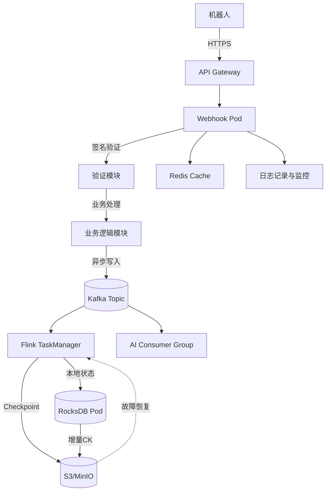

```mermaid
graph TD
    A[机器人] -->|HTTPS| B[API Gateway]
    B --> C[Webhook Pod]
    C -->|签名验证| D[验证模块]
    D -->|业务处理| E[业务逻辑模块]
    E -->|异步写入| F[(Kafka Topic)]
    F --> G[Flink TaskManager]
    G -->|本地状态| H[(RocksDB Pod)]
    G -->|Checkpoint| I[(S3/MinIO)]
    F --> J[AI Consumer Group]
    H -->|增量CK| I
    I -.->|故障恢复| G
    C --> K[Redis Cache]
    C --> L[日志记录与监控]

```

