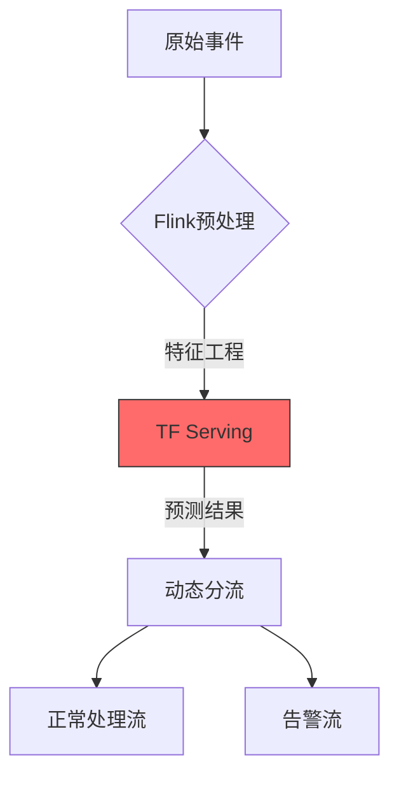

Apache Flink 作为 实时流处理中枢，其核心作用可通过以下六个关键维度完整呈现：

1. 实时状态化计算引擎        
   |场景| Flink实现方案| 技术价值|
   |--|-|-|
   |机器人状态窗口聚合| TumblingEventTimeWindows 滚动窗口| 每分钟更新10万+机器人状态快照|
   |异常行为模式检测| CEP复杂事件处理引擎 |亚秒级识别设备故障/网络攻击|
   |指令执行成功率统计 |KeyedProcessFunction 有状态计数| 精确到每个机器人的历史成功率|

```java
   复制
   // 机器人状态窗口聚合示例
   DataStream<RobotStatus> statusStream = env
   .addSource(kafkaSource)
   .keyBy("robotId")
   .window(TumblingEventTimeWindows.of(Time.minutes(1)))
   .aggregate(new StatusAggregator());
```

2. 事件时间处理与乱序补偿

```mermaid
   复制
   graph LR
   A[Kafka事件] --> B{Watermark生成}
   B -->|事件时间推进| C[窗口计算]
   B -->|延迟阈值| D[侧输出流]
   D --> E[异常数据处理]

   style C fill:#5F9EA0,stroke:#333
 
```

关键配置：

```yaml
# Flink事件时间配置
execution.time-characteristic: EventTime
auto-watermark-interval: 200ms
allowed-lateness: 30s  # 允许乱序数据
```

3. Exactly-Once状态一致性

   | 组件	|一致性保障机制	|恢复效率|
                              |--|--|--| 
   |Kafka Source	|偏移量保存到Checkpoint|	秒级回滚到最近检查点|
   |RocksDB状态后端	|增量Checkpoint + 本地状态快照	|TB级状态快速恢复|
   | PostgreSQL Sink	|两阶段提交 (2PC)|	保证数据库无重复数据|

```python
# 精确一次写入配置示例
env.enable_checkpointing(30000, CheckpointingMode.EXACTLY_ONCE)
env.get_checkpoint_config().set_min_pause_between_checkpoints(5000)
``` 

4. 多流协同处理

```java
   // 实时关联机器人状态与元数据
   DataStream<EnrichedEvent> enrichedStream = statusStream
   .connect(metaDataBroadcastStream)
   .process(new RichCoProcessFunction() {
   @Override
   public void processElement1(Status status, Context ctx, Collector<EnrichedEvent> out) {
   RobotMeta meta = metaCache.get(status.robotId);
   out.collect(new EnrichedEvent(status, meta));
   }
   });
```

5. 动态扩缩容支持

   | 场景               | Flink自适应机制            | 业务影响      |
               |------------------|-----------------------|-----------|
   | TaskManager扩容    | 状态重新分配 + KeyGroup调整   | 窗口计算不中断   |
   | JobManager故障转移   | 从最新Checkpoint恢复作业     | 30秒内自动恢复  |
   | 并行度调整            | rescale() 策略保留局部数据本地性 | 网络开销减少70% |

``` yaml
# 扩缩容关键参数
jobmanager.execution.failover-strategy: region
taskmanager.numberOfTaskSlots: 4
parallelism.default: 16
``` 

6. AI模型集成管道



- 实现方式：

```python
class ModelPredictFunction(ProcessFunction):
def process_element(self, event, ctx, out):
features = feature_engineer(event)
prediction = tf_client.predict(features)  # gRPC调用
if prediction > threshold:
ctx.output(alert_tag, event)
```

核心价值总结      
✅ 亚秒级延迟：从事件摄入到处理完成平均耗时 <500ms    
✅ 高吞吐：单作业处理能力 >1M events/sec     
✅ 状态管理：支持 TB级 机器人历史状态存储与查询    
✅ 容错保障：故障恢复后 零数据丢失      
✅ 生态集成：无缝对接 Kafka/RocksDB/TensorFlow 等组件

典型业务场景应用：      
🔸 实时计算所有机器人的 电池健康度指数    
🔸 检测 连续3次指令超时 的异常设备     
🔸 生成 区域热力图 指导清洁机器人调度

是否需要深入某个具体功能的实现细节？例如CEP规则引擎的优化策略，或与TensorFlow Serving的高性能集成方案？