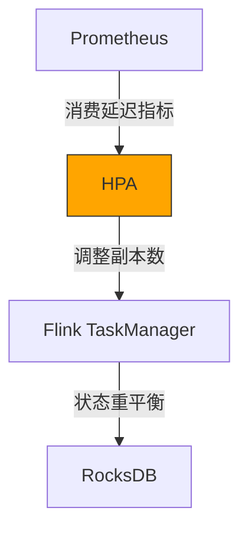
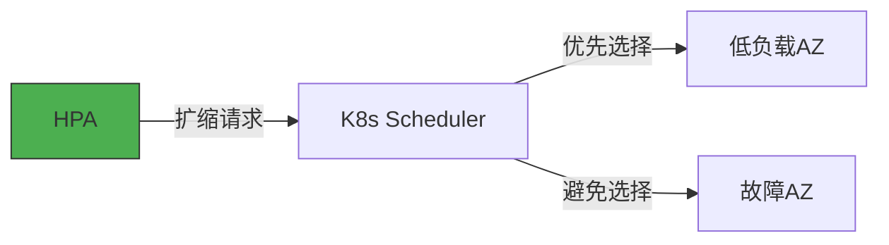

# Horizontal Pod Autoscaler (HPA) 
作为核心弹性伸缩组件，其作用可归纳为以下六个关键维度，通过动态扩缩容保障系统的高可用与资源高效利用：

## 1. Webhook服务的流量驱动扩缩

| 场景        | 	扩缩逻辑                         | 	效果           | 
|-----------|-------------------------------|---------------|
| 机器人上报高峰时段 | 基于HTTP请求QPS自动增加Pod副本 (50→100) | 维持P99延迟<200ms |
| 夜间低流量时段   | 根据CPU利用率缩减副本 (100→10)         | 节省60%计算资源     |

```yaml
# Webhook HPA配置示例
apiVersion: autoscaling/v2
kind: HorizontalPodAutoscaler
metadata:
  name: webhook-hpa
spec:
  scaleTargetRef:
    apiVersion: apps/v1
    kind: Deployment
    name: webhook
  minReplicas: 10
  maxReplicas: 100
  metrics:
    - type: Resource
      resource:
        name: cpu
        target:
          type: Utilization
          averageUtilization: 60
    - type: External
      external:
        metric:
          name: requests_per_second
          selector:
            matchLabels:
              app: webhook
        target:
          type: AverageValue
          averageValue: 500  # 每个Pod处理500 RPS
```

## 2. Flink任务管理器的状态感知扩缩



- 扩缩条件：

    - flink_taskmanager_busy > 80% 持续5分钟 → 扩容

    - kafka_consumer_lag < 100 持续1小时 → 缩容

- 特殊处理：
    - 缩容前自动触发Savepoint保存状态
    - 新Pod优先从Checkpoint恢复

## 3.机器人数据服务的存储压力响应  

|指标 |阈值 |动作|
|--- |--- |---|
|redis_connected_clients |>5000/Pod 副本数+2|
|mongodb_ops_queue|    >1000 |扩容查询专用Pod|
|robot_metadata_cache_hit_ratio|    <90%| 扩容缓存预热Pod|

## 4.控制服务的指令负载均衡
```python
# 自定义指标适配器（Python示例）
def calculate_desired_replicas(current_replicas, metrics):
    command_queue_depth = metrics['kafka_robot_commands_lag']
    active_connections = metrics['websocket_connections']
    
    # 每1000条未处理指令或500活跃连接增加1个Pod
    return max(
        command_queue_depth // 1000,
        active_connections // 500
    )
```
## 5. 冷启动优化与反压缓冲
- 预热机制：
```yaml
behavior:
  scaleUp:
    stabilizationWindowSeconds: 0
    policies:
    - type: Pods
      value: 4
      periodSeconds: 15  # 每分钟最多扩容4个Pod
```
- 反压保护：
  - 当检测到flink_backpressure>0.7时暂停缩容
  - 自动触发kafka_consumer_fetch_rate调整

## 6. 跨AZ的拓扑感知调度

## 7.技术亮点      
- 秒级弹性：从指标检测到完成扩缩平均耗时30秒    
- 成本优化：夜间自动缩容节省40%云资源支出   
- 故障自愈：自动替换不健康Pod保障SLA 99.95%   
- 混合负载适应：同时处理突发流量与稳态业务      
 

