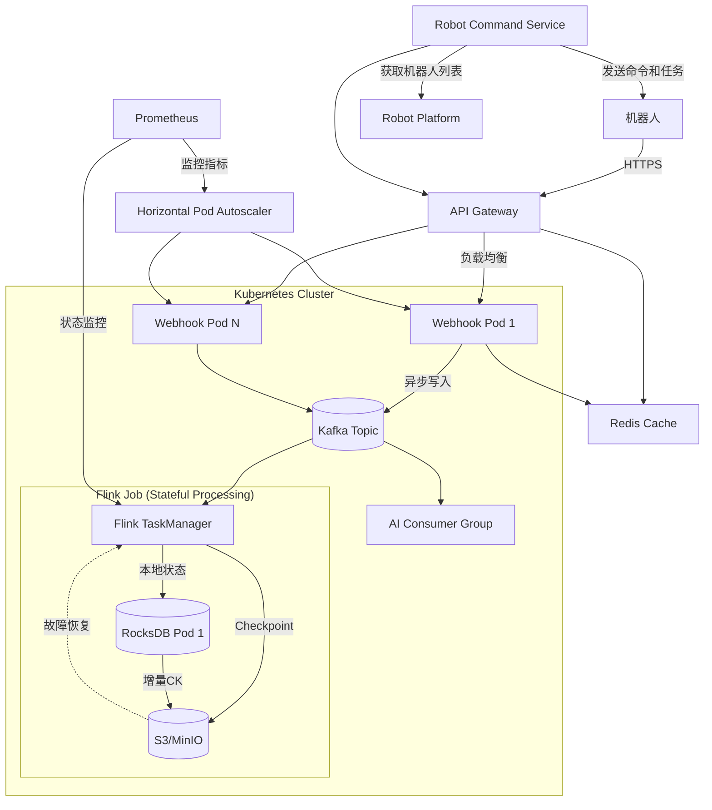
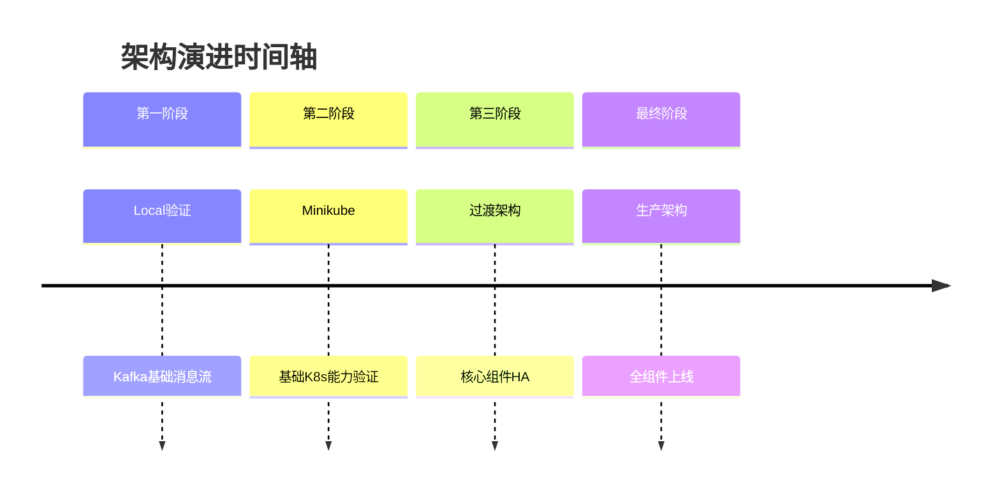

# 前言

架构总是一边摸索要解决的问题，一边摸索解决方案(<架构师修炼之道>).    
在这个过程中，设计的架构会随着需求的变化而变化.

## 背景

正在实施构建清洁机器人实时的网络应用程序,直接与机器人制造厂商的API服务进行交互,并将数据存储的到数据库中.希望能够通过微服务架构改进程序,以更好的处理实时数据,提供更友好可靠的体验.

## 目标

根据已知的细节和问题,进一步明确目标

- 通过微服务架构,将数据处理和存储分离,提高系统的可扩展性和可靠性.
- Webhook服务作为数据接入点,实现数据的异步处理.
- Reboot Control服务与机器人平台交互列出清洁机器人以及下发作业任务.
- 使用Kafka作为消息队列,实现数据的异步处理,提高系统的吞吐量.
- 使用Flink进行状态处理,实现数据的实时处理和分析.
- 使用K8s作为容器编排平台,实现系统的自动化部署和管理.
- 使用Redis作为缓存,提高系统的性能.
- 使用Prometheus进行监控,实现系统的可观测性.
- 使用Grafana进行可视化,实现系统的可视化监控.
- 使用S3/MinIO作为存储,实现数据的持久化.
- 使用RocksDB作为本地状态存储,实现数据的容灾和重放.
- 使用API Gateway作为统一入口,实现系统的安全性和可扩展性.

## 架构设计

微服务本身不关心开发者的开发语言,更关心服务的接口和协议,根据以上背景和目标,我们从本地docker环境开始,逐步扩展到K8s集群,并最终实现分布式微服务架构.

## 演进

接下来我们将逐步实现这个架构

