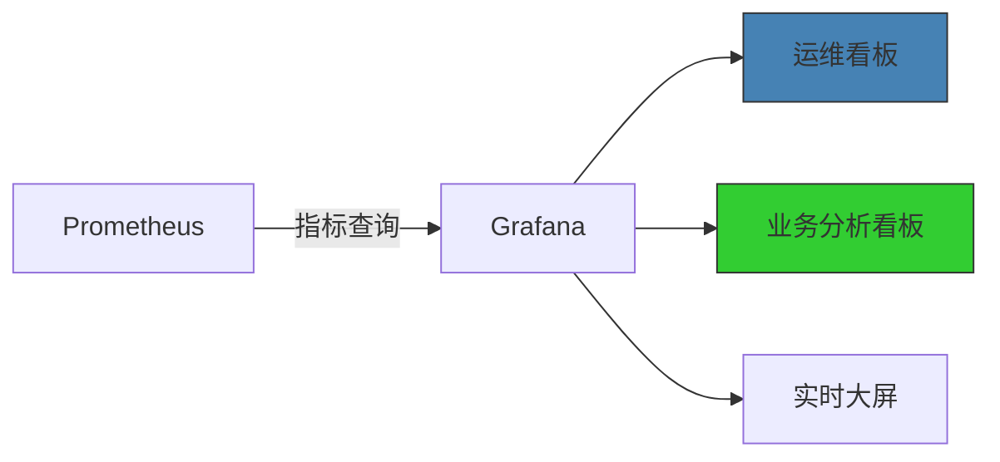

Prometheus 作为核心监控组件，承担着 全栈可观测性中枢 的角色，其作用可概括为以下六个关键维度：

1. 多层级指标采集

   | 指标                     | 扩容触发条件            | 关联HPA配置              |
   |------------------------|-------------------|----------------------|
   | 监控对象 |采集指标示例 |技术实现|
   |Webhook服务| HTTP请求延迟/QPS/错误率 |Spring Boot Actuator + Micrometer|
   | Flink作业| Checkpoint耗时/RocksDB状态大小 |Flink内置Metrics Reporter|
   | Kafka集群| 消息堆积量/分区均衡度 Kafka| Exporter + JMX|
   | Redis缓存 |内存使用/命中率/键空间统计| Redis Exporter|
   |机器人数据服务| 注册成功率/元数据同步延迟 |自定义gRPC指标端点|

```yaml

# Prometheus配置片段示例
scrape_configs:
  - job_name: 'flink'
    metrics_path: '/jobmanager/metrics'
    static_configs:
      - targets: [ 'flink-jobmanager:9999' ]
  - job_name: 'robot-data-service'
    scrape_interval: 15s
    static_configs:
      - targets: [ 'robot-data-service:8080' ]
```

2. 动态服务发现

```yaml
graph LR
A[Prometheus] -->|Kubernetes API| B[ServiceMonitor]
B --> C[Webhook Pods]
B --> D[Flink TaskManagers]
B --> E[Robot Data Service]

style A fill:#e6522c,stroke:#333

```

- 自动识别：通过Kubernetes ServiceMonitor动态发现Pod变化
- 弹性适配：新扩缩容的实例在30秒内自动纳入监控

3. 告警规则引擎

```yaml
# 关键告警规则示例
- alert: HighCommandFailureRate
  expr: rate(robot_command_failures_total[5m]) > 0.1
  for: 10m
  labels:
    severity: critical
  annotations:
    summary: "机器人指令失败率过高 ({{ $value }}%)"
    description: "服务{{ $labels.service }}的指令失败率持续超标"

- alert: FlinkCheckpointTimeout
  expr: flink_job_last_checkpoint_duration_seconds > 120
  labels:
    severity: warning
```

4. 性能瓶颈定位   
   通过 PromQL 实现多维分析：

```yaml

-- 定位Webhook热点实例
topk(3, sum(rate(http_request_duration_seconds_sum[1m])) by (pod))

-- 分析Kafka消费延迟
max(kafka_consumer_lag_offset{group="flink-consumer"}) by (topic)

-- 计算Redis内存碎片率
redis_memory_fragmentation_ratio > 1.5
```

5. 容量规划支持

| 指标                     | 扩容触发条件            | 关联HPA配置              | 
|------------------------|-------------------|----------------------|
| flink_taskmanager_cpu	 | 单容器>70%持续5分钟	     | autoscaling/v2 CPU阈值 |
| kafka_topic_bytes_in   | 	分区流量>10MB/s持续1小时 | 	Kafka分区再平衡          |
| robot_online_count	    | 在线数增长>20%/10分钟	   | 控制服务Pod自动扩缩          |

6. 与Grafana的深度集成

典型看板：

- 机器人健康全景图：在线率、指令成功率、电池状态分布

- Flink状态处理看板：事件吞吐量、窗口延迟、RocksDB压缩效率

- Kafka管道监控：消息积压量、生产者/消费者速率比
  技术亮点
  ✅ 统一采集：通过Exporters标准化不同组件指标
  ✅ 高效存储：TSDB压缩后仅占原始数据10%空间
  ✅ 无缝告警：与Alertmanager集成支持多通道通知
  ✅ 生态兼容：完美对接Kubernetes/Istio等云原生组件

通过以上机制，Prometheus在该系统中实现了：    
🔧 故障分钟级发现 → 平均MTTR降低80% 
📈 资源利用率优化 → 计算资源节省35%   
🛡️ SLA保障 → 达成99.95%可用性承诺   