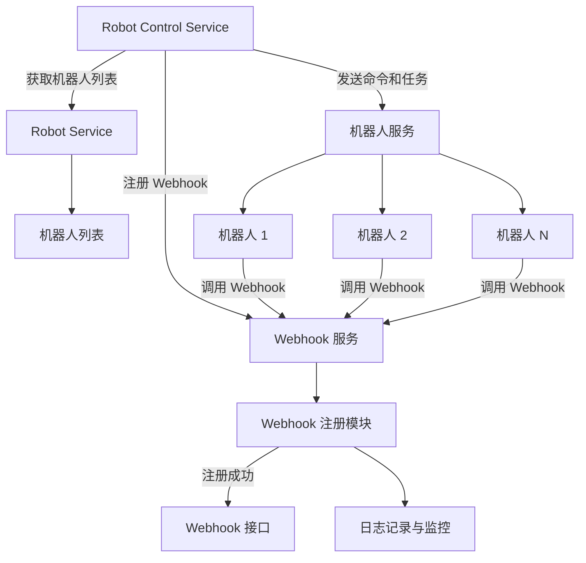

# Robot Control API Service

机器人控制API服务

## 功能
- 从机器人提供商服务列出机器人
- 下发作业任务到清洁机器人
- 注册 Webhook供回调上报状态
- ...

## Graph

```mermaid
graph TD
    A[Robot Control Service] -->|获取机器人列表| B[Robot Service]
    B --> C[机器人列表]
    A -->|发送命令和任务| D[机器人服务]
    D --> E[机器人 1]
    D --> F[机器人 2]
    D --> G[机器人 N]
    
    A -->|注册 Webhook| H[Webhook 服务]
    H --> I[Webhook 注册模块]
    I -->|注册成功| J[Webhook 接口]

    %% 机器人通过 Robot Service 调用 Webhook
    E -->|调用 Webhook| H
    F -->|调用 Webhook| H
    G -->|调用 Webhook| H
    I --> L[日志记录与监控]

```