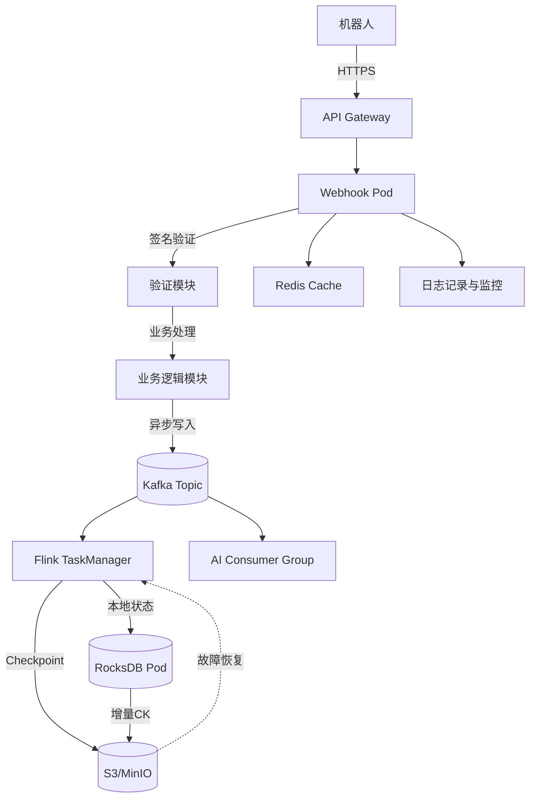

# Webhook

WebHook 的单例实现, 通过HTTP POST请求接收机器人发送的消息, 进行签名验证, 然后将消息异步写入Kafka Topic, 供Flink处理.

- Webhook接入机器人数据.
- 校验签名.
- 写入kafka管道

```mermaid
graph TD
    A[机器人] -->|HTTPS| B[API Gateway]
    B --> C[Webhook Pod]
    C -->|签名验证| D[验证模块]
    D -->|业务处理| E[业务逻辑模块]
    E -->|异步写入| F[(Kafka Topic)]
    F --> G[Flink TaskManager]
    G -->|本地状态| H[(RocksDB Pod)]
    G -->|Checkpoint| I[(S3/MinIO)]
    F --> J[AI Consumer Group]
    H -->|增量CK| I
    I -.->|故障恢复| G
    C --> K[Redis Cache]
    C --> L[日志记录与监控]

```