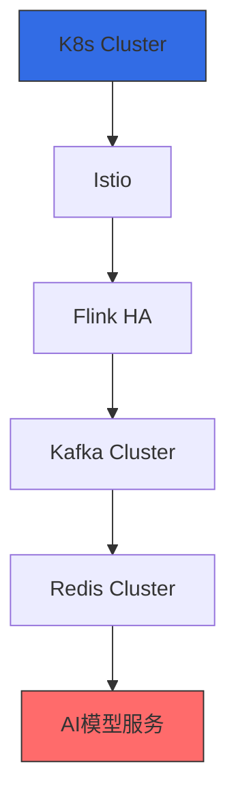

# 阶段实施演进

在前期我们需要做一些验证性的东西,随着业务的增长逐步过渡到最终的设计方案

## 阶段一：最小可行验证（Local开发环境）

技术栈：


实现步骤：

1.一键启动依赖：

```yaml
# docker-compose-local.yml
version: '3'
services:
  kafka:
    image: bitnami/kafka:3.4
    ports: [ "59092:9092" ]
    #....
  redis:
    image: redis:alpine
    ports: [ "56379:6379" ]
    # ....
  api-server:
    build: ./api-server
    ports: [ "58080:8080" ]
    #.....
  webhook-server:
    build: ./webhook-server
    ports: [ "58081:8081" ]
    #....
  kafka-ui: 
    image: dockerized/kafka-ui
    ports: [ "58082:8080" ]
    environment:
      KAFKA_CLUSTERS_0_NAME: "local"
      KAFKA_CLUSTERS_0_BOOTSTRAPSERVERS: "kafka:9092"
  #....
```

2.开发模式配置：

```java 
// Flink本地环境配置
StreamExecutionEnvironment env = StreamExecutionEnvironment
    .createLocalEnvironmentWithWebUI(new Configuration());
env.setParallelism(2); // 本地模拟并行度
```

3.验证重点：

- 机器人状态上报→Kafka→Flink处理→Redis存储的完整链路

-  模拟10个机器人并发上报（使用Postman或Python脚本）

-  通过Redis CLI查询实时状态

## 阶段二：准生产验证（Minikube集群）

架构升级点：

- 引入Minikube单节点集群
- 配置ConfigMap管理环境变量
- 添加Prometheus基础监控

关键操作：

```bash 
# 启动Minikube并部署基础组件
minikube start --cpus=4 --memory=8g
kubectl apply -f kafka-single-pod.yaml  # 简化版Kafka
kubectl expose pod kafka --port=9092 --type=NodePort

# 开发期快速调试
kubectl port-forward svc/webhook 8080:80
```

验证重点：

- Pod故障重启（kubectl delete pod模拟）

- ConfigMap热更新效果

- 基础监控指标查看（CPU/内存）

## 阶段三：核心组件高可用（过渡架构）
业务量增长后的关键组件强化

**分步实施**：

1.Kafka集群化：

```yaml
# kafka-statefulset.yaml
kind: StatefulSet
spec:
  serviceName: "kafka"
  replicas: 3
  volumeClaimTemplates:
    - metadata: { name: data }
      spec: { storageClassName: "local-ssd", resources: { requests: { storage: 100Gi } } }
```

2.Flink HA部署：

```bash 
helm install flink flink-operator \
  --set taskmanager.replicas=2 \
  --set jobmanager.highAvailability.enabled=true
```

3.Redis哨兵模式：

``` yaml
# redis-ha.yaml
config:
  sentinel monitor mymaster redis-0 6379 2
  sentinel down-after-milliseconds mymaster 5000
```

验证重点：

- 随机杀死Kafka Pod测试消息不丢失

- Flink JobManager故障自动转移

- Redis主从切换数据一致性
## 阶段四：最终架构 

支撑百万级设备接入 

完整技术栈启用：
>Istio 是一个可配置的开源服务网格层，用于连接、监控和保护 Kubernetes 集群中的容器。


关键迁移操作：

1.数据迁移：

```bash
# Kafka数据镜像
kafka-mirror-maker --consumer.config source.conf \
                   --producer.config target.conf \
                   --whitelist "webhook-events"
```

2.渐进式流量切换：

```yaml
# Istio VirtualService
http:
  - route:
      - destination: { host: webhook.new, weight: 10 }  # 逐步调大
      - destination: { host: webhook.old, weight: 90 }
```

验证工具包推荐

| 场景   | 工具                | 使用方式                        |
|------|-------------------|-----------------------------|
| 压力测试 | k6                | k6 run --vus 1000 script.js |
| 混沌工程 | Chaos Mesh        | 注入网络延迟/Pod故障                |
| 链路追踪 | Jaeger            | 查看跨服务调用链                    |
| 配置验证 | ConfigMap Auditor | 检查配置合规性                     |
